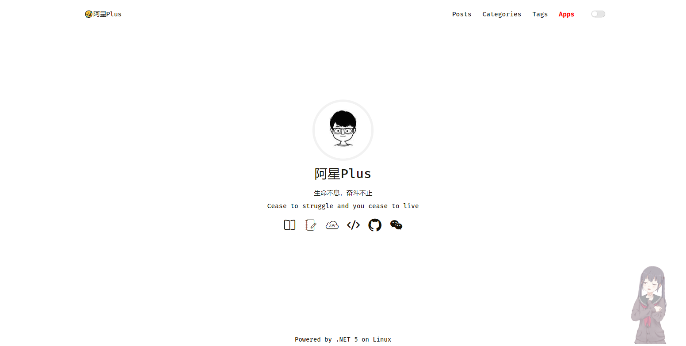
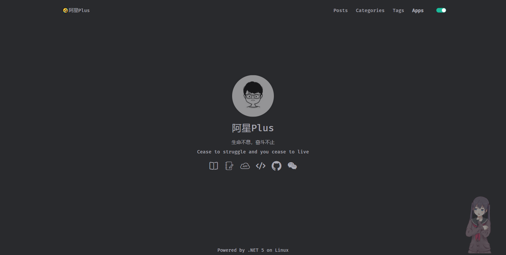
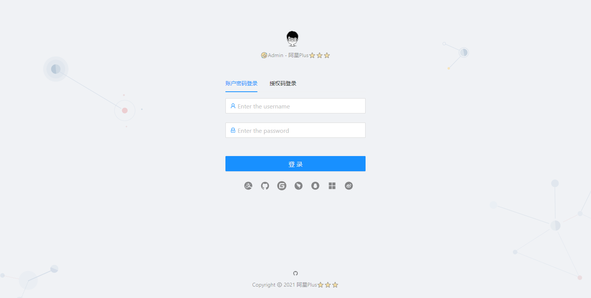
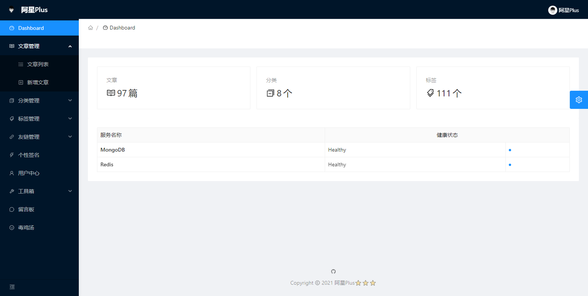
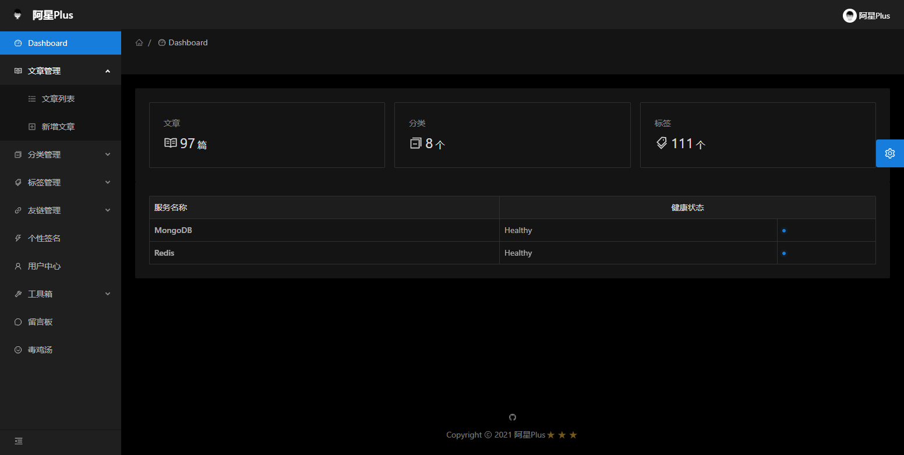
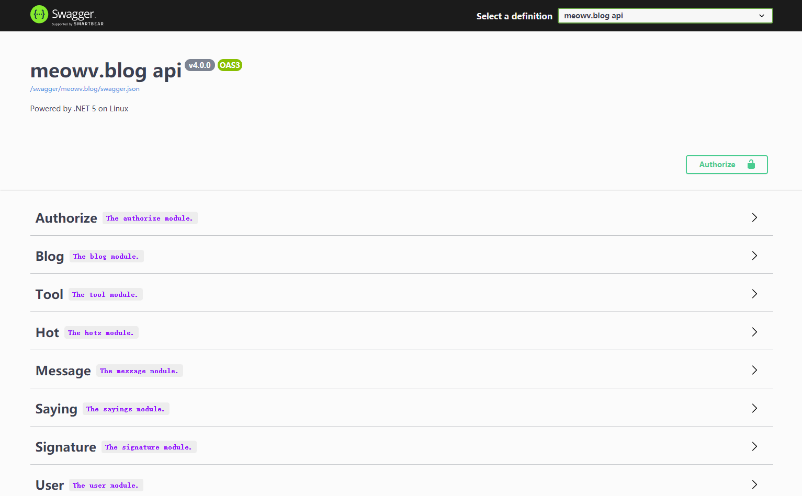

# 🤣A Xing Plus⭐⭐⭐ Personal Blog

## Project Overview

This project has several development versions; the latest version is built on [abp vNext](http://abp.io) Building a free, open-source, cross-platform framework [.NET5](https://dot.net) The project was developed using MongoDB for data storage and Redis for data caching. It was built using a separate front-end and back-end architecture, with the API adhering to the RESTful interface specification, and the pages utilizing [Blazor](http://blazor.net) Developed as a starter project for learning .NET Core.

**Note: This is a historical version; please switch to a different branch to view it.**

If you liked `Blog` project or if it helped you, please give a star ⭐️ for this repository. 👍👍👍

```tree
blog
 ├── assets ---------- assets
 ├── LICENSE ---------- LICENSE
 ├── meowv.blog.sln ---------- Solution
 ├── README.md ---------- README.md
 └── src
     ├── Meowv.Blog.Admin ---------- Admin项目 admin.meowv.com
     ├── Meowv.Blog.Api ---------- Api项目 api.meowv.com
     ├── Meowv.Blog.Application ---------- Application
     ├── Meowv.Blog.BackgroundWorkers ---------- BackgroundWorkers
     ├── Meowv.Blog.Core ---------- Core
     ├── Meowv.Blog.DbMigrator ---------- DbMigrator
     ├── Meowv.Blog.MongoDb ---------- MongoDb
     ├── Meowv.Blog.Response ---------- Response
     └── Meowv.Blog.Web ---------- Web项目 meowv.com
```

## Preview Experience

### Web Project：[https://meowv.com](https://meowv.com)





### Admin Project：[https://admin.meowv.com](https://admin.meowv.com)







### Api Project：[https://api.meowv.com](https://api.meowv.com)



## [Article Overview](https://docs.meowv.com/aspnetcore/abp-blog/)

### v3.4.0

1. **[Set up a project using the ABP CLI](https://mp.weixin.qq.com/s/3Sc4Z2xkLdQNErvXf92B9A)**
2. **[Streamline the project and get it up and running](https://mp.weixin.qq.com/s/oc96GG2sxz0J_vT6sReojQ)**
3. **[Refined and Enhanced: Introducing Swagger](https://mp.weixin.qq.com/s/usz1BRYzBO2tT_z9MaonPg)**
4. **[Data-First and Code-First](https://mp.weixin.qq.com/s/OHBW24PSNIeOARnHlbWBNQ)**
5. **[CRUD Operations for Custom Storage](https://mp.weixin.qq.com/s/ObgAtdWe3-nZw6hWC5dhyg)**
6. **[Standardize the API and wrap the return model](https://mp.weixin.qq.com/s/uVsFiKjbiHX5lKAhuZ2E9g)**
7. **[Speaking of Swagger: groups, descriptions, and the little green lock](https://mp.weixin.qq.com/s/cNB469s18plbCLbHxL1QUA)**
8. **[Connect to GitHub and secure your API with JWT](https://mp.weixin.qq.com/s/ZOX9D4ncqqeXxipYapTeBA)**
9. **[Exception Handling and Logging](https://mp.weixin.qq.com/s/segjYoh1rMI372PKi-ap6w)**
10. **[Caching Data with Redis](https://mp.weixin.qq.com/s/fTqDnwVUgqKnwz21AsETGA)**
11. **[Integrating Hangfire to Implement Scheduled Tasks](https://mp.weixin.qq.com/s/wRITvM72JveP7ozx2tDL4A)**
12. **[Handling Object Mapping with AutoMapper](https://mp.weixin.qq.com/s/VO0qKlOg90kb27XGcpGjqw)**
13. **[Practical Series (Part 1)](https://mp.weixin.qq.com/s/DkGuy4jJ629ARh5gMq5I_Q)**
14. **[Practical Series (Part 2)](https://mp.weixin.qq.com/s/vGg14QchfUjNcNuOBfw7Tg)**
15. **[Practical Series (Part 3）](https://mp.weixin.qq.com/s/rFvsLuqZtdUnkqxRhN29rw)**
16. **[Practical Series (Part 4)](https://mp.weixin.qq.com/s/5tTMKfZvXvi1Z7NJ3yZdvg)**
17. **[Practical Series (Part 5)](https://mp.weixin.qq.com/s/2nmw2td01cEhqBCc32FUYw)**
18. **[Practical Series (Part 6)](https://mp.weixin.qq.com/s/B0AwLunJ6xSqJzXwE_qJSg)**
19. **[Practical Series (Part 7)](https://mp.weixin.qq.com/s/3V7Q-RvaxEiopXR73YpG5Q)**
20. **[Blog API Practical Guide (Part 5)](https://mp.weixin.qq.com/s/B3jvHCtKotmmlcAKYxL9Lw)**
21. **[Blazor Practical Series（1）](https://mp.weixin.qq.com/s/gtnZ74ItGmocpxDcOVswng)**
22. **[Blazor Practical Series（2）](https://mp.weixin.qq.com/s/RVX94RPnEteHouz_0BDayw)**
23. **[Blazor Practical Series（3）](https://mp.weixin.qq.com/s/9pC456tnmjJNMS55aEe9Qg)**
24. **[Blazor Practical Series（4）](https://mp.weixin.qq.com/s/Y0zGpc4L2eAvUd0ba6Hbkg)**
25. **[Blazor Practical Series（5）](https://mp.weixin.qq.com/s/dj4ubCqqjCWRc6mXPsgqBw)**
26. **[Blazor Practical Series（6）](https://mp.weixin.qq.com/s/-W3JQHOxYLYxAb13ZSVhnQ)**
27. **[Blazor Practical Series（7）](https://mp.weixin.qq.com/s/q1BHEk8TNRRczBGRGecBPw)**
28. **[Blazor Practical Series (Part 8)）](https://mp.weixin.qq.com/s/ZCYJa3f3HYPclM6bpmynNA)**
29. **[Blazor Practical Series (Part 9)](https://mp.weixin.qq.com/s/0-mMmkr3HelmoJUWN7R7JA)**
30. **[The Final Chapter: Project Launch](https://mp.weixin.qq.com/s/Lf543XOxSIGYdOGM8Zt4Lw)**

### v4.0.0

TODO...

## LICENSE

This project is licensed under [MIT](LICENSE).
